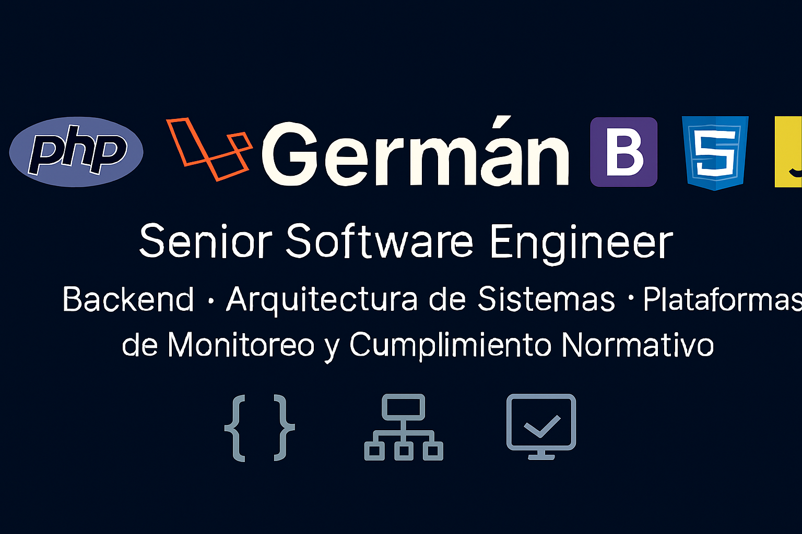

# Germán

---

## Sobre mí

Ingeniero de software con más de 10 años de experiencia diseñando, construyendo y manteniendo sistemas backend de misión crítica.

Especializado en plataformas de adquisición y procesamiento de datos, sistemas regulatorios y arquitecturas orientadas a servicios.  
Experiencia en entornos productivos que requieren integridad de datos, trazabilidad, disponibilidad y escalabilidad.

He participado en:

- Diseño de arquitecturas backend escalables
- Integración con dispositivos de adquisición de datos (dataloggers)
- Implementación de APIs REST robustas
- Optimización de rendimiento y modelamiento de datos
- Contenerización y despliegue en entornos productivos
- Soporte y evolución de plataformas regulatorias

---

## Stack Técnico

### Lenguajes
- JavaScript
- PHP
- Python

### Backend & Frameworks
- Node.js
- Laravel
- Django

### Arquitectura & DevOps
- Docker
- Kubernetes
- Diseño de APIs REST
- Arquitectura orientada a servicios
- Principios de Clean Architecture

### Bases de Datos
- PostgreSQL
- MySQL
- SQL Server
- MongoDB

---

## Proyectos Relevantes

### NLOGGER – Sistema de Adquisición de Datos (Datalogger)
Plataforma backend para captura, validación y almacenamiento de datos provenientes de dispositivos de monitoreo.  
Enfocado en confiabilidad, persistencia eficiente y procesamiento estructurado de grandes volúmenes de información.

### DAHS – Sistema Normativo para la SMA
Sistema orientado al cumplimiento regulatorio, con foco en trazabilidad, validación y control de integridad de datos ambientales.  
Diseñado para operar en entornos donde la consistencia y auditoría son críticas.

---

## Enfoque Profesional

- Código mantenible y orientado a largo plazo
- Diseño centrado en dominio y claridad estructural
- Decisiones técnicas basadas en estabilidad y escalabilidad
- Documentación técnica clara
- Evolución continua de sistemas en producción

---

## Contacto

german@sisep.cl
